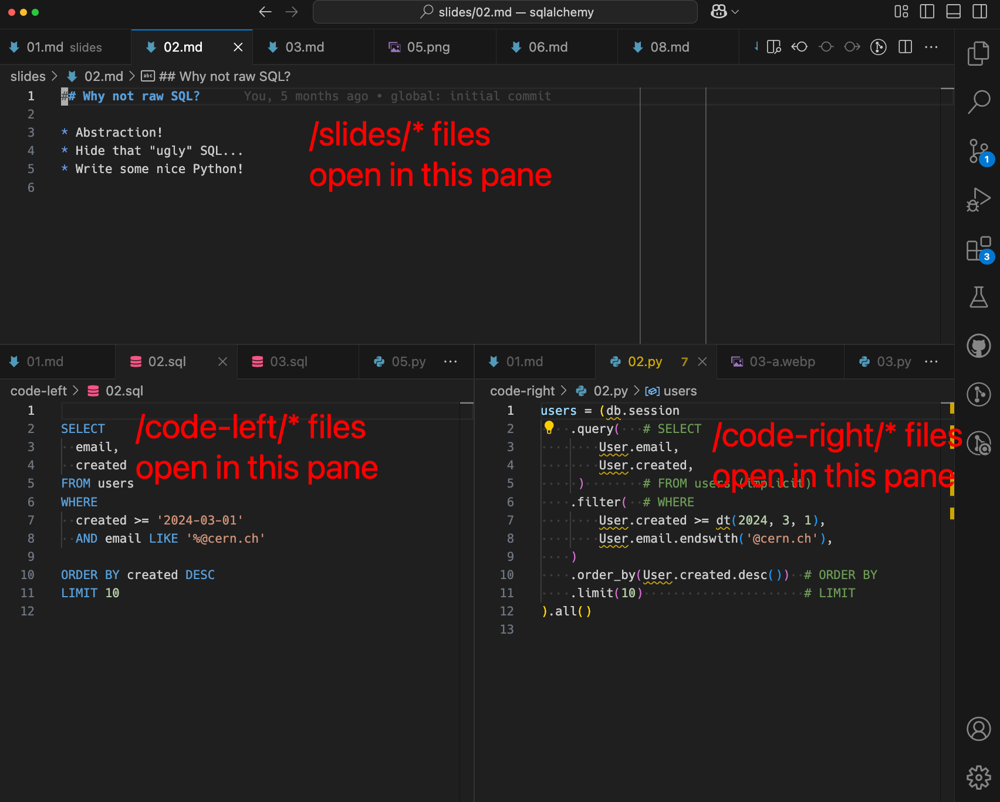

# Invenio SQLAlchemy Training

This repository contains training material for Invenio SQLAlchemy.

## Usage

To present this interactive training, you'll need to setup the following "layout" in
your VS Code (or other editor that supports similar features):

Afterwards you just go through the numbered tabs in order, present the slides and
for for each left/right code pane, ask participants the questions marked with ❓.
